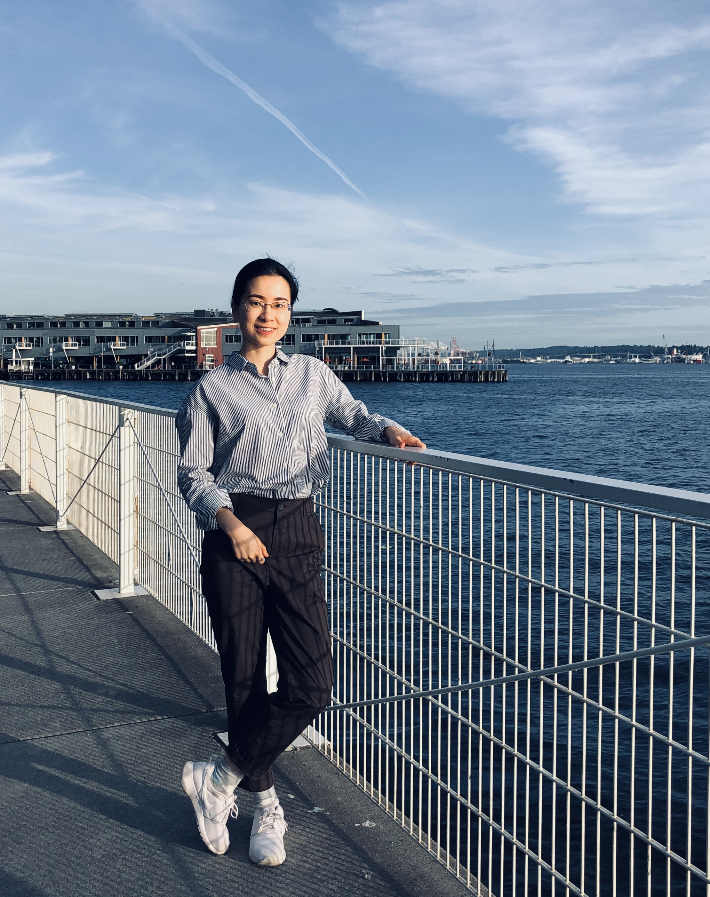

::: {.profile}

{.profile-photo}

::: {.profile-text}

### Sharon Zhou

[PhD Student · Committee on Evolutionary Biology · University of Chicago]{.subtitle}

I study how evolutionary processes shape biological variation across scales — from macroevolutionary patterns of morphological complexity in marine bivalves to population-genetic models of linked selection and complex-trait architecture.

I'm a PhD student in Evolutionary Biology at the University of Chicago, working with [David Jablonski](https://geosci.uchicago.edu/people/david-jablonski/) on macroevolution and morphological complexity, and with [Jeremy Berg](http://www.jjbpopgen.org/) on population-genetic theory and linked selection.

::: {.contact-links}
[Email](mailto:zhous@uchicago.edu) · [Google Scholar](https://scholar.google.com/citations?user=MjskfFEAAAAJ) · [GitHub](https://github.com/sharonyiwenz)
:::

:::

:::

## Research Interests

::: {.interests}
[Macroevolution]{.interest-tag}
[Morphological complexity]{.interest-tag}
[Linked selection]{.interest-tag}
[Quantitative genetics]{.interest-tag}
[Multilocus theory]{.interest-tag}
[Computational evolutionary biology]{.interest-tag}
:::

## News

- **Spring 2026** — Teaching assistant for Quantitative Genetics for the 21st Century
- **2025** — Presented at Midwest Population Genetics Conference, Minneapolis
- **2025** — GSA North-Central Section Student Travel Grant
